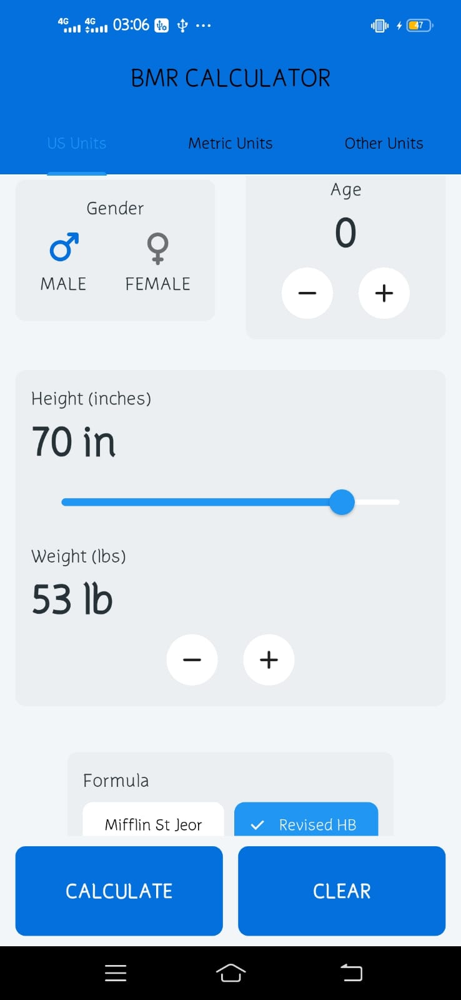
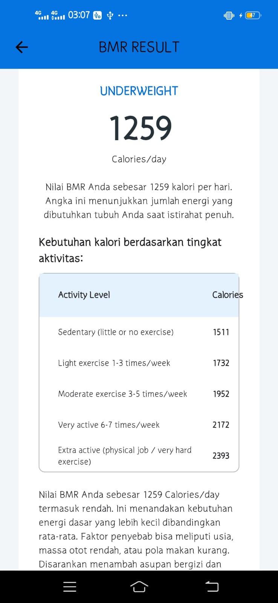

# BMR Calculator
Aplikasi **BMR Calculator** dibuat menggunakan **Flutter** untuk menghitung *Basal Metabolic Rate (BMR)* dan memperkirakan kebutuhan kalori harian berdasarkan tingkat aktivitas pengguna.

## Anggota Kelompok
1. Rahayu Eriyana (K3523060)
2. Rifdah Hanun Alfiyah (K3523068)

## Deskripsi Singkat
Aplikasi ini membantu pengguna mengetahui kebutuhan energi dasar tubuh berdasarkan:
- **Jenis kelamin**
- **Usia**
- **Berat dan tinggi badan**
- **Persentase lemak tubuh (opsional)**
- **Rumus pilihan:** Mifflin-St Jeor, Revised Harris-Benedict, atau Katch-McArdle  

## Fitur Utama
1. Menghitung nilai **BMR (Basal Metabolic Rate)**
2. Memilih satuan: **US Units**, **Metric Units**, dan **Other Units**
3. Memilih formula perhitungan: **Mifflin-St Jeor**, **Revised Harris-Benedict**, **Katch-McArdle**
4. Menampilkan **tabel aktivitas dan kebutuhan kalori**
5. Tampilan bersih dan responsif menggunakan **Material Design Flutter**

## Screenshot Aplikasi
<p align="center">
  <br>
  <em>Tampilan US Unit</em>
</p>

<p align="center">
  <br>
  <em>Tampilan Metric Unit</em>
</p>

<p align="center">
  <br>
  <em>Tampilan Other Unit</em>
</p>

<p align="center">
  <br>
  <em>Tampilan Calculate/Result</em>
</p>

## Cara Menjalankan :
1. Pastikan sudah menginstal Flutter SDK
   ```bash
   flutter --version

2. Clone repository (atau ekstrak ZIP proyek ini):
    ```bash
    git clone https://github.com/riffiya/BMR_Calculator.git
  jika tidak menggunakan Git, cukup ekstrak folder proyek ke dalam komputer 
  
3. Masuk ke folder proyek:
    ```bash
   cd BMR_Calculator
    
4. Unduh semua dependensi Flutter:
    ```bash
   flutter pub get

5. Jalankan aplikasi:
   ```bash
   flutter run

Jika ada error pada asset, pastikan file pubspec.yaml berisi:
   ```bash
   dependencies:
     flutter:
        sdk:
     flutter font_awesome_flutter: ^10.6.0


